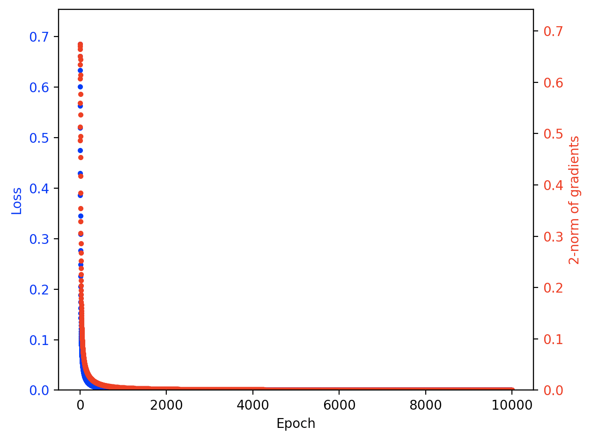
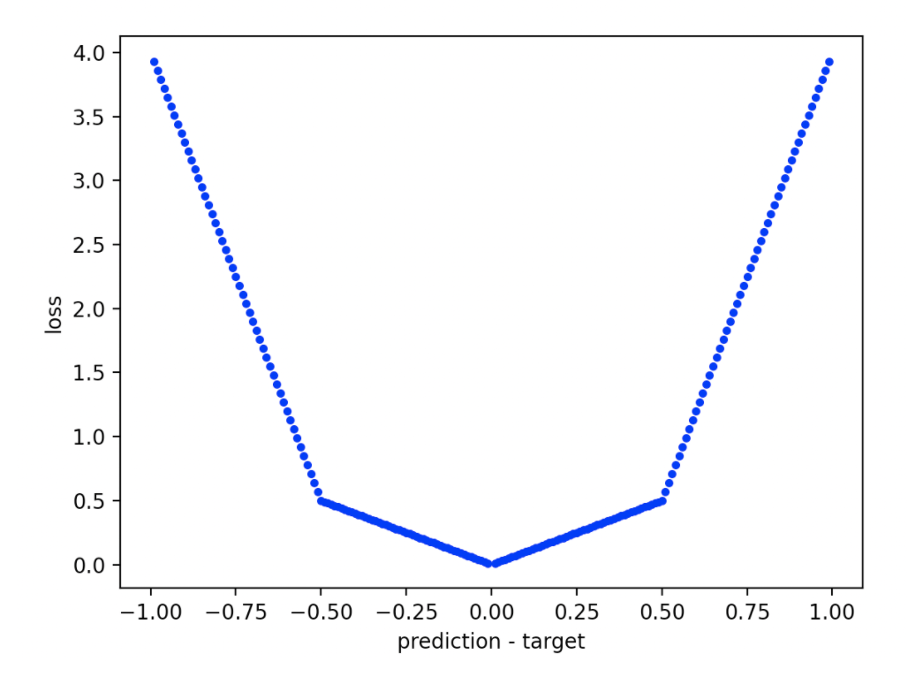

# Defining capability and alignment in gradient descent

## Context

This repo holds functions that implement a few experiments in capability and alignment in a gradient descent optimizer. It's intended to investigate the definitions from [this post on the Alignment Forum](https://www.alignmentforum.org/posts/Xg2YycEfCnLYrCcjy/defining-capability-and-alignment-in-gradient-descent).

To keep things as simple as possible, most of the experiments I did are being run on a subset of the [MNIST dataset](http://yann.lecun.com/exdb/mnist/) — specifically, just the `3`s and `7`s. This "MNIST sample" dataset is kindly hosted by [Fast AI](https://www.fast.ai/), which also provides convenience methods to download it from their servers via their `fastai` package.

As a sanity check, I also used this repo to replicate a small part of the [Rethinking generalization paper by Zhang et al. (2017)](https://arxiv.org/pdf/1611.03530.pdf) from the Google Brain team from scratch — to prove that my setup is able to memorize random labels. As a result, this repo also contains functions for downloading and using the [CIFAR10 dataset](https://www.cs.toronto.edu/~kriz/cifar.html), because that's the dataset Zhang et al. (2017) ran their experiments on. A copy of CIFAR10 is also hosted by Fast AI.

## Associated materials

I used this repo to run a series of experiments on the MNIST sample and CIFAR10 datasets in early December 2020.

- Written notes and results related to those experiments [can be found in this Google doc](https://docs.google.com/document/d/1wQrgQrhFhMM3B-18SZkQrd0hOso-OcLi1YcSxLxRtjo/edit?usp=sharing). This doc is publicly viewable, so feel free to take a look. If you'd like to leave feedback or have questions about it, please request comment access.

- I've saved the results from those experiments. They're permanently hosted in [this publicly accessible zip archive on Google Drive](https://drive.google.com/file/d/1S0KPkH9ctTO9gB0OOFOsIh1xoROsluVv/view?usp=sharing). Feel free to download them if you'd like to verify or reproduce.

## Installation, setup, and testing

👉 _Some systems use `python3` instead of `python` in the **first** of the following commands. This repo will only work with Python 3._

1. Activate `virtualenv`. Run:

  ```
  % python -m venv venv
  % source venv/bin/activate
  ```

2. Ensure pip is up to date and download required packages. Run:

  ```
  % pip install --upgrade pip
  % pip install -r requirements.txt
  ```

3. Run the `test()` function that will download the MNIST sample dataset, and ensure everything's been installed correctly. Run:

  ```
  % python -i main.py
  ```

  Then:

  ```
  >>> experiment = test()
  ```

4. Confirm that the output you get is consistent. You should see something like:

  ```
  Building raw data for label "3"...
  Building raw data for label "7"...
  Epoch: 0	 Loss: 0.6850721836090088	 Accuracy: 0.501953125	 Gradients: 0.6344888035840699
  Epoch: 1	 Loss: 0.6610113978385925	 Accuracy: 0.5546875	 Gradients: 0.487084653802744
  Epoch: 2	 Loss: 0.6335671544075012	 Accuracy: 0.76171875	 Gradients: 0.5132478148422407
  Epoch: 3	 Loss: 0.6009854674339294	 Accuracy: 0.90625	 Gradients: 0.559999133739283
  Epoch: 4	 Loss: 0.5626939535140991	 Accuracy: 0.953125	 Gradients: 0.6072993747192088
  .
  .
  .
  Epoch: 9995	 Loss: 9.086752834264189e-05	 Accuracy: 1.0	 Gradients: 0.000329744703760587
  Epoch: 9996	 Loss: 9.085543570108712e-05	 Accuracy: 1.0	 Gradients: 0.0003303928630500971
  Epoch: 9997	 Loss: 9.084566409001127e-05	 Accuracy: 1.0	 Gradients: 0.00032984759753678213
  Epoch: 9998	 Loss: 9.083475015359e-05	 Accuracy: 1.0	 Gradients: 0.00032959894601751206
  Epoch: 9999	 Loss: 9.082406177185476e-05	 Accuracy: 1.0	 Gradients: 0.0003299404913909065

  TEST-EXPERIMENT-lr_0&1-bs_512-eps_10000_62675cf54013492f9bb5aa84ae306390
  ```

  The test function should then show a plot that looks like this:

  

## Usage

### Running an experiment

🟣 To run an experiment, use the `run_one_experiment` function. I recommend passing it an input `dict` with the values of all non-default inputs in it. For example:

```
>>> inputs = {
      'model': nn.Sequential(nn.Linear(28*28, 32), nn.ReLU(), nn.Linear(32, 2)),
      'learning_rate': 0.1,
      'dataset_size': 512,
      'batch_size': 512,
      'epochs': 10000,
      'parameters_seed': 0,
      'loss_function': metrics.cross_entropy_loss,
      'classification_labels': ['3', '7'],
      'whiten_images': False,
      'data_path': utils.download_dataset('mnist_sample', 'data'),
      'randomize_dataset_seed': 0,
      'experiment_nickname': 'TEST-EXPERIMENT'
  }
>>> experiment = lib.run_one_experiment(**inputs)
```

This lets you think of the input dict as being the canonical description of an experiment, which helps a lot with reproducibility.

🔵 Here are the input arguments to `run_one_experiment` and what they mean:

(Listed as `name [type] (default): description`.)

- `model [torch.nn model] (None)`: The model architecture, with parameters initialized. Should have 784 (28 x 28) input channels and 2 output channels for an un-cropped MNIST sample, or 3072 (32 x 32 x 3) input channels and 10 output channels for an un-cropped CIFAR10.

  Typical value: `nn.Sequential(nn.Linear(28**2, 32), nn.ReLU(), nn.Linear(32, 2))`

- `learning_rate [float || list] (None)`: Either a fixed learning rate (if it's a `float`) or a learning rate schedule (if it's a `list`). If it's a `list` of learning rates, you have to make sure `len(learning_rate) == epochs` because the `i`th learning rate in the list will be applied at the `i`th epoch.

  Typical value: `0.1`

- `dataset_size [int] (None)`: The size of the dataset we'll be training on. This should be a number that's **divisible by the number of classes in your dataset**, whether that's MNIST sample or CIFAR10. That's because the data loader ensures that it loads an equal number of elements of each class for training. If you set `dataset_size` to be big enough (e.g., `100000`), it will just load all of the training images from each class, so the dataset may be uneven if you do that.

  Typical value: `512`

- `batch_size [int] (None)`: The size of the mini-batches that will be used to train the `model`. Should be less than or equal to `dataset_size`. In my experiments, I often set `batch_size == dataset_size`.

  Typical value: `512`

- `epochs [int] (None)`: The number of epochs we'll be training on. I usually set this pretty high, since I'm mainly interested in limiting behavior.

  Typical value: `10000`

- `loss_function [custom loss function] (metrics.cross_entropy_loss)`: The loss function we'll use for training. Defaults to the cross-entropy loss. The other loss function available is `metrics.accuracy_loss`. There are also arbitrary custom loss functions available for binary classification tasks (see below).

  Typical value: `metrics.cross_entropy_loss`

- `parameters_seed [int || None] (None)`: The random seed that will be used to initialize the parameter values of the `model`. Helps make the experiments more reproducible. If `None`, we don't set the parameter seed manually and parameters are initialized randomly.

  Typical value: `0`

- `data_path [pathlib.PosixPath] (data.DATA_PATH)`: The path to the root folder that holds the training data. In theory this is a `pathlib` object, but in practice you should use either `utils.download_dataset('cifar10', data.TARGET_FOLDER)` for the CIFAR10 dataset, or `utils.download_dataset('mnist_sample', data.TARGET_FOLDER)` for the MNIST sample dataset.

- `randomize_labels_seed [int || None] (None)`: A random seed to randomize the training labels on the images. I use this to check that a given training regime is able to memorize a dataset.

  If set to `None`, use the correct training labels to train the model (i.e., no randomization).

  Typical value: `0`

- `randomize_dataset_seed [int || None] (None)`: A random seed to randomize the training images that are selected from each class in the training dataset. For example, if there are 6000 images of `3`s and 6000 images of `7`s in the MNIST sample dataset and our dataset size is 512, setting this seed makes us select 256 `3`s and 256 `7`s at random. I use this to check how robust a given setup is to a change in data drawn from the same distribution.

  If set to `None`, construct the dataset deterministically by choosing the first N images as ranked by the `sorted()` function.

  Typical value: `0`

- `whiten_images [bool] (True)`: If true, apply `utils.whiten_images` to each image tensor. This implements [the algorithm described here](https://github.com/petewarden/tensorflow_makefile/blob/master/tensorflow/g3doc/api_docs/python/functions_and_classes/tf.image.per_image_whitening.md), which sets the mean of each image to 0 and its standard deviation to 1. This seems most useful on CIFAR10, but doesn't seem to make a difference on the MNIST sample dataset.

  Typical value: `True`

- `classification_labels [list] (data.CLASSIFICATION_LABELS)`: The list of labels for the training data classes. Should be a list of strings corresponding to the names of the folders holding each respective training class. The position of each training label in the list corresponds to the index of that class in predictions made by the `model`.

  Typical value: `['3', '7']`

- `crop_size [int] (28)`: The linear dimension of an input training image. Should be an **even** integer. If this is less than the size of the image (for example, 28 on a CIFAR10 image that's 32 x 32 pixels), the image gets cropped to that size from the center. If this is greater than the size of the image, no transformation is applied to the image.

  Typical value: `28`

- `compute_metrics_every [int] (1)`: How often you want to run `lib.validate_epoch`, which computes and prints the accuracy, loss function, and gradients over the training dataset. For example, if you set this to `10`, this will only record metrics every 10 epochs. Smaller numbers give better resolution; bigger numbers slow down training.

  Typical value: `1`

- `experiment_nickname [str] ('')`: A human-readable designation for your experiment, which makes it easier to identify in the output folder afterwards. This will get paired with a unique `uuid`, so even if two nicknames are the same, the actual file names will be unique.

  Typical value: `'model_32_hidden_units-learning_rate_0&1-dataset_512-batch_512-mnist-epochs_10000-4_section_crossent_simulated_loss-randomize_labels'`

- `beep [bool] (True)`: If `True`, emit a beeping noise when training is done.

  Typical value: `True`

- `plot [bool] (True)`: If `True`, plot the learning curves for the experiment when training is done.

  Typical value: `True`

- `save [bool] (True)`: If `True`, save the experiment (both the inputs and the outputs) to the folder `data.EXPERIMENT_FOLDER`.

  Typical value: `True`

🟢 The `run_one_experiment` function returns an output dict that looks like this:

```
{
      'inputs': {
          'model': model,
          'learning_rate': learning_rate,
          'dataset_size': dataset_size,
          'batch_size': batch_size,
          'epochs': epochs,
          'loss_function': loss_function,
          'parameters_seed': parameters_seed,
          'data_path': data_path,
          'randomize_labels_seed': randomize_labels_seed,
          'whiten_images': whiten_images,
          'classification_labels': classification_labels,
          'crop_size': crop_size
      },
      'outputs': {
          'model': [torch.nn model] `The final trained model.`,
          'losses': [list] `The values of the training loss at every epoch of training.`,
          'accuracies': [list] `The values of the training accuracies at every epoch of training.`
          'gradients': [list] `The 2-norms of the gradients at every epoch of training.`
      }
  }
```

This format is designed to make it possible to reproduce experiments as easily as possible, since it encourages you to keep the inputs and outputs of an experiment together in the same data structure. That makes it really simple to check the exact inputs against the reported output of a run.

### Using custom loss functions

🟣 It's possible to create loss functions that have arbitrary piecewise-continuous shapes, **but only for binary classification problems**. You do this by calling `metrics.loss_function_factory` like this:

```
>>> lf = metrics.loss_function_factory([-1, -0.5, 0, 0.5, 1], [lambda x: -7*x - 3, lambda x: -x, lambda x: x, lambda x: 7*x - 3])
```

This gives you a loss function that looks like this:



Binary loss functions are defined on the domain `[-1, 1]` where a positive number means the prediction overshot the true value, and a negative number means the prediction undershot the true value.

🔵 Here are the input arguments to `loss_function_factory` and what they mean:

(Listed as `name [type] (default): description`.)

- `domain_interval [list]`: A list of floats that define the boundaries between domains of the loss function on the interval `[-1, 1]`. The first element of this list should be `-1`, and the last element of the list should be `1`. The list should be ordered from lowest to highest.

  Typical value: `[-1, -0.5, 0, 0.5, 1]`

- `piecewise_func_list [list]`: A list of `lambda` functions that define the functions on each subdomain in `domain_interval` that will be glued together at the boundaries. This list should have **one element less** than the `domain_interval` list. The values of the functions in this list should be **approximately equal** at their respective boundary points (to within `1e-15`).

🟢 The `loss_function_factory` function should output a loss function that can be used normally in, e.g., `run_one_experiment`.

### Saving and loading experiments

🟣 To **save an experiment that you've run**, use the `save_experiment` function on the output `dict` from `run_one_experiment`. For example:

```
>>> experiment = lib.run_one_experiment(**inputs)
>>> data.save_experiment(experiment, 'my-experiment')
```

🔵 Here are the input arguments to `save_experiment` and what they mean:

(Listed as `name [type] (default): description`.)

- `experiment [dict]`: The experiment you want to save. This should be the **output** of the `run_one_experiment` function.

- `experiment_nickname [str] ('')`: A nickname you can give your experiment. This will be prepended to the experiment name that the function generates automatically.

  Typical value: `'my-experiment'`

- `experiment_folder [str] (data.EXPERIMENT_FOLDER)`: The folder you want to save your experiment to.

🟣 To **load a previous experiment that you'd saved**, use the `load_experiment` function. For example:

```
>>> experiment = data.load_experiment('my-experiment-lr-1_bs-512_eps-10000-6ac6e93ddf9c4272bd4b917ab42e1267')
```

🔵 Here are the input arguments to `load_experiment` and what they mean:

- `file_name [str]`: The file name of the experiment. This should include the `.pkl` extension.

- `experiment_folder [str] (lib.experiment_folder)`: The folder you want to save your experiment to.

🟢 The `load_experiment` function will output an experiment `dict`.

### Visualizing results

There are also a few functions that I designed to help diagnose issues or visualize intermediate steps in an experiment.

🟣 To plot a loss function **on the accuracy domain**, use the `plot_loss_function` function. For example:

```
>>> viz.plot_loss_function(metrics.cross_entropy_loss)
```

🔵 The input argument to `plot_loss_function` is:

- `loss_function [custom loss function]`: The loss function you want to plot. Keep in mind that the domain over which the loss function is plotted is -0.99 to 0.99. A positive number means the prediction is above the correct value, and a negative number means the prediction is below the correct value.

🟣 To visualize an image from the dataset, use `show_image`. For example:

```
>>> x_data, y_data = data.build_dataset(512, ['3', '7'])
>>> viz.show_image(x_data[0])
```

🔵 The input arguments to `show_image` are:

- `flat_image_tensor [torch.tensor]`: A 1-D tensor representing the image you want to visualize. This is how `data.build_dataset` outputs the images it consumes from its data folder.

- `color_channels [int] (None)`: The number of color channels in the original image. This will normally be `3` for CIFAR10, and `None` for MNIST (because MNIST images have no axis assigned to color channels).

  If `None`, expects a flattened image without color channels.

🟣 To visualize the training curves from an experiment, use `plot_learning_curves`. For example:

```
>>> experiment = lib.run_one_experiment(**inputs)
>>> viz.plot_learning_curves(experiment['outputs']['losses'], experiment['outputs']['gradients'])
```

🔵 The input arguments to `plot_learning_curves` are:

- `losses [list] (None)`: A list of the loss values recorded during training. These get plotted in blue.

  If `None`, don't plot losses.

- `gradients [list] (None)`: A list of gradient 2-norms recorded during training. These get plotted in red.

  If `None`, don't plot gradients.

# Fitting random labels

I originally made this repo to replicate a small part of the [rethinking generalization paper by Zhang et al. (2017)](https://arxiv.org/pdf/1611.03530.pdf) from scratch.

I'd found earlier that, training on a subset of MNIST (3s and 7s), I couldn't get the training error to converge to zero when using a very simple training setup that should be able to memorize the training set after a large number of epochs. To figure out what was going wrong, I reproduced Zhang et al.'s MLPs on CIFAR10 to see if I could get a model to fully memorize all the labels.

Then I incrementally updated my setup towards the MNIST setup that I was using earlier, to see at which point memorization failed. It turns out the using a pure accuracy loss function, as opposed to cross-entropy, is enough to destroy memorization in a system like this.

## Protocol

I copied my protocol from the paper's _Appendix A — Experimental setup_.

Here are the key sections:
> The CIFAR10 dataset contains 50,000 training and 10,000 validation images, split into 10 classes. Each image is of size 32x32, with 3 color channels. We divide the pixel values by 255 to scale them into [0, 1], crop from the center to get 28x28 inputs, and then normalize them by subtract- ing the mean and dividing the adjusted standard deviation independently for each image with the per_image_whitening function in TENSORFLOW (Abadi et al., 2015).

> [...] We also test standard multi-layer perceptrons (MLPs) with various number of hidden layers.

> [...] The MLPs use fully connected layers. MLP 1x512 means one hidden layer with 512 hidden units. All of the architectures use standard rectified linear activation functions (ReLU).

> For all experiments on CIFAR10, we train using SGD with a momentum parameter of 0.9. An initial learning rate of [...] 0.01 (for small Alexnet and MLPs) are used, with a decay factor of 0.95 per training epoch. Unless otherwise specified, for the experiments with randomized labels or pixels, we train the networks without weight decay, dropout, or other forms of explicit regularization.

Note that Table 1 in the paper says that their "1 x 512" MLP had exactly 1,209,866 parameters, which corresponds to a (28x28x3 x 512) input layer, and a (512 x 10) hidden layer.

**I used a constant learning rate in this repo**, rather than SGD with momentum as the Zhang et al. team did. The reason is that I found a constant learning rate worked fine to get the system to converge to 0 loss.

I also found that a key component of getting memorization on CIFAR10 was setting `whiten_images` to `True`. Convergence is far slower when you don't whiten the images.
